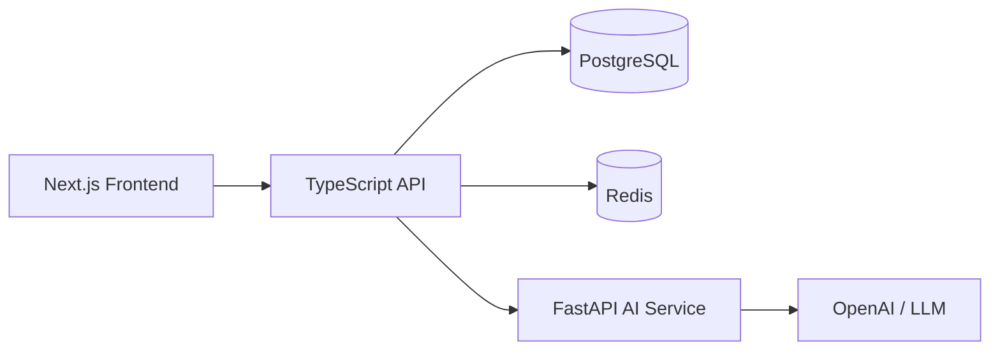

# NEXUS

**AI Developer Intelligence & Career Engineering Platform**

NEXUS is not a chatbot wrapper. It is an evidence-based developer intelligence system that connects your real engineering output — repositories, code, resumes, assessments — into explainable scores, skill graphs, and career tools.

## Why NEXUS Is Different

| Feature | Generic AI Tools | NEXUS |
|---|---|---|
| Skill claims | User types "I know React" | Evidence from 4 repositories, TypeScript usage, component patterns |
| Career advice | Generic LLM response | Personalized from your skill graph, job gaps, interview weaknesses |
| Resume analysis | Keyword matching | ATS scoring + evidence correlation + version comparison |
| Interview prep | Static questions | Adaptive questions that follow up on weak answers |

## Architecture



### Monorepo Structure

```
apps/
  web/          Next.js 14 frontend
  api/          Express + TypeScript API
services/
  ai/           FastAPI AI service
prisma/         Database schema & migrations
e2e/            Playwright E2E tests
docs/           Architecture documentation
```

## Features

### Authentication & Profiles
- Registration, login, logout with HTTP-only session cookies
- bcrypt password hashing, session expiration, rate limiting
- User profiles with target role and experience

### GitHub Intelligence
- Public repository import and analysis
- GitHub OAuth for private repository access
- Language detection, README analysis, deterministic scoring
- Repository metadata persistence

### Developer Intelligence Engine
- Evidence-based scoring: code quality, documentation, testing, architecture
- Skill graph with domain → skill → evidence → repository relationships
- Explainable scores with confidence and evidence trails

### Resume Intelligence
- PDF upload with text extraction (pdf-parse)
- ATS scoring, keyword analysis, missing keyword detection
- Resume versioning and comparison
- AI-enhanced parsing when OpenAI key is configured

### Job Matching
- Job description parsing (heuristic + AI)
- Skill gap analysis against developer profile
- Match scoring with evidence

### Adaptive Interviews
- Topic-based technical interviews (JS, TS, React, Node, System Design, AI, Behavioral)
- AI-powered question generation and answer evaluation
- Follow-up questions based on weaknesses
- Score tracking per question

### AI Coding Lab
- Coding challenges with submissions
- Static code review via AI (no unsafe code execution)
- Complexity analysis and optimization feedback

### Personalized Roadmaps
- Generated from skill gaps, target role, and interview weaknesses
- Priority-ordered learning items
- Progress tracking

### Notifications
- Analysis completion, interview results, roadmap updates

## Quick Start

### Prerequisites
- Node.js 20+
- Docker & Docker Compose
- (Optional) OpenAI API key for AI features

### Setup

```bash
# 1. Clone and install
git clone https://github.com/Monish892/Nexus.git
cd Nexus
npm install

# 2. Configure environment
cp .env.example .env
# Edit .env with your values

# 3. Start infrastructure
docker-compose up -d

# 4. Run migrations
npx prisma migrate deploy
npx prisma generate

# 5. Seed demo data
npx prisma db seed

# 6. Start development
npm run dev:api   # API on :4000
npm run dev:web   # Web on :3000
```

### Demo Account
After seeding: `demo@nexus.local` / `password123456`

## API Endpoints

| Method | Path | Description |
|--------|------|-------------|
| POST | /auth/register | Create account |
| POST | /auth/login | Sign in |
| POST | /auth/logout | Sign out |
| GET | /auth/me | Current user |
| GET | /profile | Get profile |
| PATCH | /profile | Update profile |
| GET | /github/repositories | List repositories |
| POST | /github/import | Import & analyze repo |
| GET | /dashboard/summary | Dashboard data |
| POST | /resume/upload | Upload & analyze PDF |
| GET | /resume | List resumes |
| POST | /jobs/parse | Parse job description |
| POST | /jobs/:id/match | Match against profile |
| POST | /interviews/start | Start interview |
| POST | /interviews/:id/answer | Submit answer |
| GET | /coding/challenges | List challenges |
| POST | /coding/challenges/:id/submit | Submit code |
| GET | /roadmaps | List roadmaps |
| POST | /roadmaps/generate | Generate roadmap |
| GET | /notifications | List notifications |
| GET | /intelligence/skill-graph | Skill graph data |

## Testing

```bash
npm run typecheck    # TypeScript validation
npm run build        # Production builds
npm test             # Unit tests
npm run test:e2e     # Playwright E2E (requires running servers)
```

## Security

- HTTP-only, SameSite cookies (no JWT in localStorage)
- bcrypt password hashing (cost 12)
- Rate limiting on auth endpoints
- Zod input validation on all routes
- Helmet security headers
- CORS restricted to configured origin
- GitHub tokens stored server-side only
- User data isolation (all queries filter by userId)
- No arbitrary code execution (coding lab uses AI static review)
- Audit logging for auth and profile changes

## Documentation

- [Architecture](docs/architecture.md)
- [Development Log](docs/development-log.md)

## License

Private — All rights reserved.
