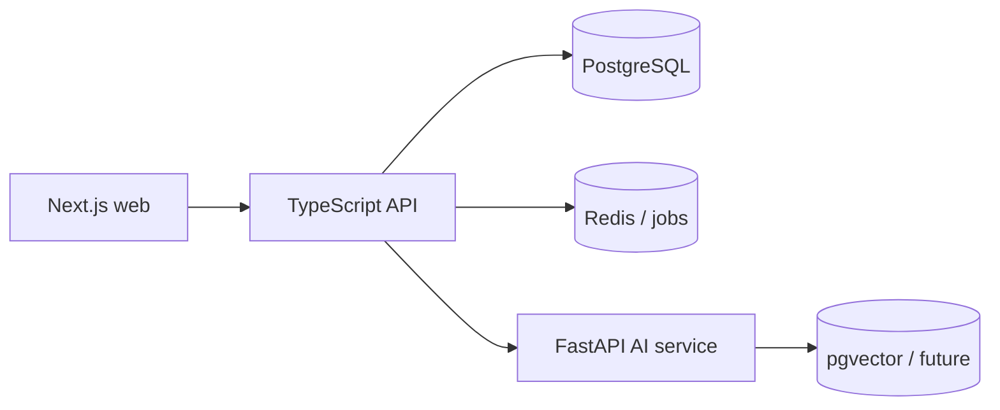

# NEXUS Architecture

NEXUS is organized as a small monorepo: `apps/web` owns the responsive Next.js experience, `apps/api` owns authenticated domain APIs, and `services/ai` owns Python AI workflows. PostgreSQL is the source of truth; Redis will support caching and BullMQ jobs as domain modules arrive.

Authentication uses server-side, opaque sessions. Only a SHA-256 token hash is persisted; the raw token is sent in an HTTP-only, SameSite cookie. API authorization is enforced by middleware and role checks, independently of frontend route protection. User profiles are a one-to-one extension of the user identity, and auth/profile events are audit logged.

Day 2 adds the first protected product flow: register → login → authenticated dashboard → logout. Intelligence modules deliberately render empty states until evidence is ingested.
