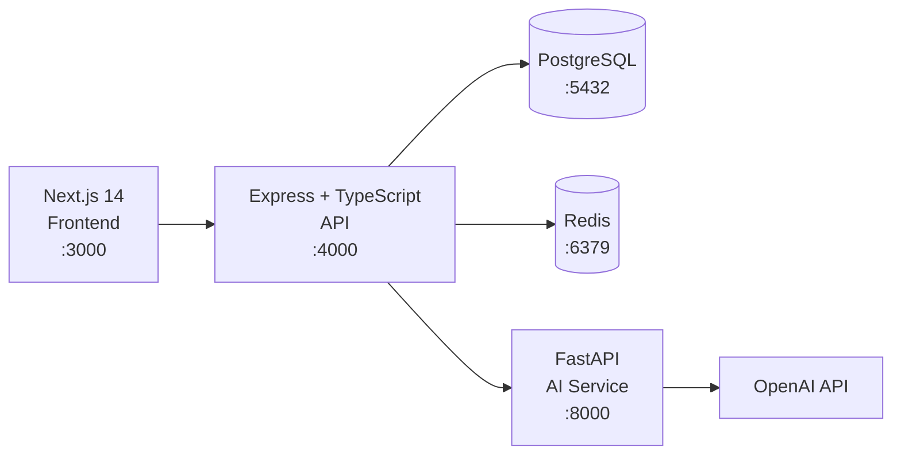

# NEXUS Architecture

NEXUS is organized as a monorepo with three services:

## Service Boundaries

### `apps/web` — Frontend
- Next.js 14 with App Router
- React 18, vanilla CSS design system
- Client-side state with React hooks
- Cookie-based authentication (credentials: 'include')

### `apps/api` — API
- Express 4 with TypeScript
- Modular route architecture: auth, profile, github, dashboard, resume, jobs, interviews, coding, roadmaps, notifications, intelligence
- Prisma ORM with PostgreSQL
- Zod validation on all inputs
- Session-based auth with SHA-256 token hashing

### `services/ai` — AI Service
- FastAPI (Python)
- Health endpoint
- Extensible for LangGraph agents, RAG pipelines

## Database

PostgreSQL with Prisma ORM. Models:

- **Identity**: User, Profile, Session, AuditLog
- **GitHub**: GitHubAccount, Repository, RepositoryLanguage, RepositoryActivity, RepositoryAnalysis
- **Intelligence**: DeveloperScore, Skill, SkillEvidence, SkillAssessment, Project, ProjectAnalysis
- **Resume**: Resume, ResumeVersion, ResumeAnalysis
- **Jobs**: JobDescription, JobMatch, SkillGap
- **RAG**: Document, DocumentChunk, EmbeddingMetadata
- **AI**: AIConversation, AIMessage, AgentExecution
- **Interview**: Interview, InterviewQuestion, InterviewAnswer, InterviewEvaluation
- **Coding**: CodingChallenge, CodingSubmission, CodeEvaluation
- **Roadmap**: Roadmap, RoadmapItem, RoadmapProgress
- **Notifications**: Notification

## Security Model

- Opaque session tokens in HTTP-only cookies
- SHA-256 token hashing (raw token never stored)
- bcrypt password hashing (cost 12)
- Rate limiting on auth routes
- Helmet security headers
- CORS restricted to WEB_ORIGIN
- All queries filter by authenticated userId
- GitHub tokens stored server-side only
- No arbitrary code execution

## AI Architecture

AI features use a dual-mode approach:
1. **Deterministic analysis** for calculable signals (language count, README length, keyword matching)
2. **LLM-enhanced analysis** when OPENAI_API_KEY is configured (resume parsing, job matching, interview evaluation, code review)

All LLM responses are validated with structured output (JSON mode) and wrapped in error handling with deterministic fallbacks.
