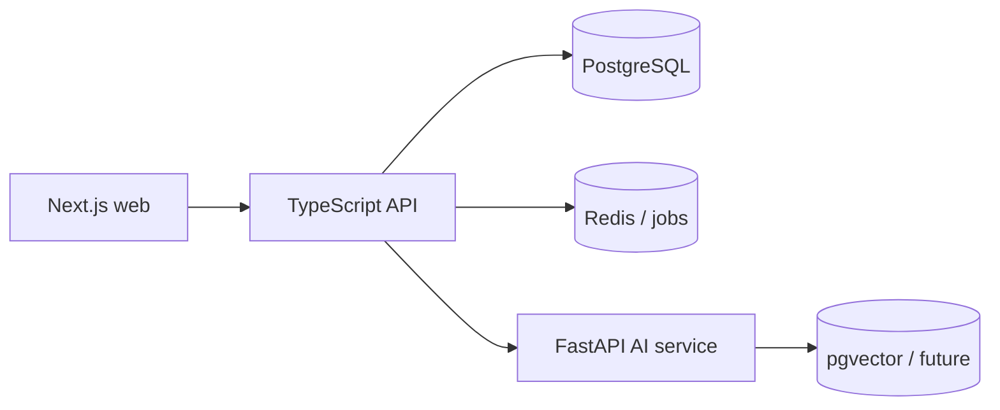

# NEXUS Architecture

NEXUS is organized as a small monorepo: `apps/web` owns the responsive Next.js experience, `apps/api` owns authenticated domain APIs, and `services/ai` owns Python AI workflows. PostgreSQL is the source of truth; Redis will support caching and BullMQ jobs as domain modules arrive.

Day 1 deliberately establishes contracts and runtime health endpoints before feature modules.
